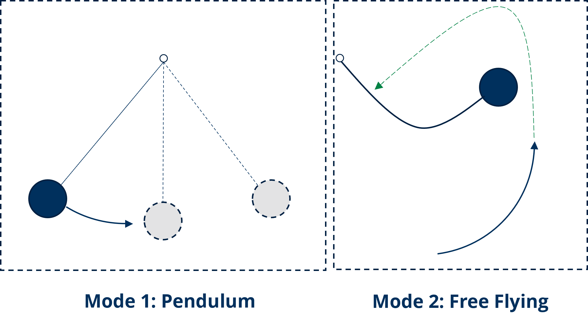
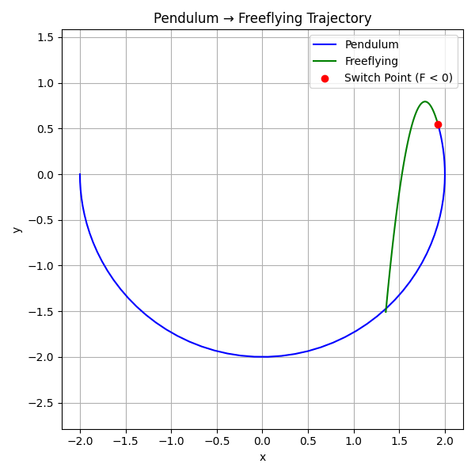

# Structure Overview

## 📁 Modelica Models

Source models written in Modelica:

- `Pendulum.mo` - Pendulum system model
- `Freeflying.mo` - Freeflying system model

------

## 📁 FMU Models

Exported FMUs (Functional Mock-up Units) for both FMI (2.0/3.0) standards:

### FMI 2.0

- `PendulumFMI2.0.fmu`
- `FreeflyingFMI2.0.fmu`

### FMI 3.0

- `PendulumFMI3.0.fmu`
- `FreeflyingFMI3.0.fmu`

------

## 📁 Simulation Scripts

These Python scripts to simulate the FMUs using the corresponding FMI standard.

### Standard FMI Simulations

- `FMI2.0.py` - Simulates FMI 2.0 FMUs
- `FMI3.0.py` - Simulates FMI 3.0 FMUs

### Petri Net-Controlled Simulations

These scripts integrate Petri Net logic for more advanced control strategies during the simulation.

- `PN_FMI2.0.py`
- `PN_FMI3.0.py`

## 👓 Example

Running any of the script will simulate the following pendulum - freeflying VSS.

