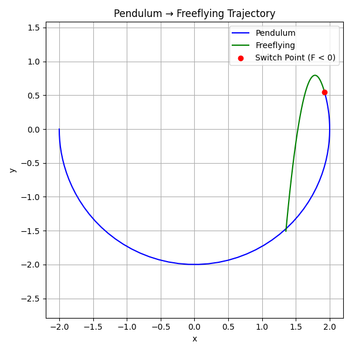
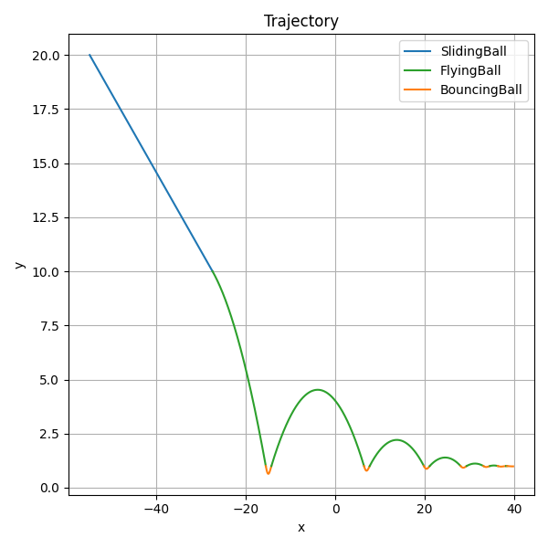

# FMUVSS

This framework enables developers to realize VSS through a user-friendly interface.

## How To Use?

Modify the configuration section in `FMUVSS.py` according to your needs, and then run it.

```python
# === Configuration ===
config = {
    'simulation': {
        'initial_time': 0,
        'global_stop_time': 10,
        'step_size': 0.00001,
        'initial_mode': 'SlidingBall'
    },
    'modes': {
        'SlidingBall': {
            'fmu_path': './Ball.fmu',
            'monitored_vars': ['y'],  
            'outputs': ['x', 'y', 'vx', 'vy'],
            'stop_condition': lambda vars: vars['y'] < 10,
            'transition_mapping': {
                'FlyingBall': {'x' : 'x', 'y' : 'h', 'vx' : 'vx', 'vy' : 'vy'}
            },
            'next_mode': 'FlyingBall',
        },
        'FlyingBall': {
            'fmu_path': './FlyingBall.fmu',
            'monitored_vars': ['h', 'r'],
            'outputs': ['x', 'h', 'vx', 'vy'],
            'stop_condition': lambda vars: vars['h'] < vars['r'],
            'transition_mapping': {
                'BouncingBall': {'x' : 'x', 'h' : 'h', 'vx' : 'vx', 'vy' : 'v'}
            },
            'next_mode': 'BouncingBall',
        },
        'BouncingBall': {
            'fmu_path': './ContactBall.fmu',
            'monitored_vars': ['mass.s', 'r'],
            'outputs': ['x', 'h', 'vx', 'v'],
            'stop_condition': lambda vars: vars['mass.s'] > vars['r'],
            'transition_mapping': {
                'FlyingBall': {'x' : 'x', 'h' : 'h', 'vx' : 'vx', 'v' : 'vy'}
            },
            'next_mode': 'FlyingBall',
        }
    },
    'plot': {
        'x': 'x',
        'y': 'height',
        'variable_aliases': {
            'height': {
                'SlidingBall': 'y',
                'FlyingBall': 'h',
                'BouncingBall': 'h'
            }
        },
        'title': 'Trajectory',
        'xlabel': 'x',
        'ylabel': 'y',
        'figsize': (6, 6)
    }
}
```


## Examples

#### 1. Pendulum-Freeflying



#### 2. SlidingBall-FlyingBall-BouncingBall



#### 3. Rocket-Satellite-SatelliteChange

