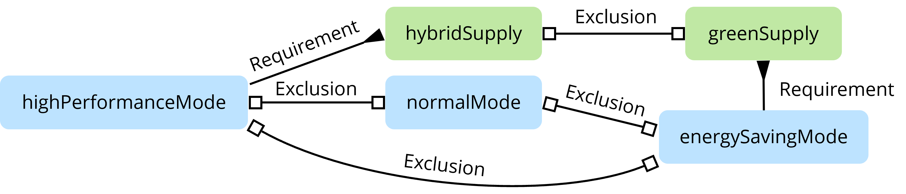
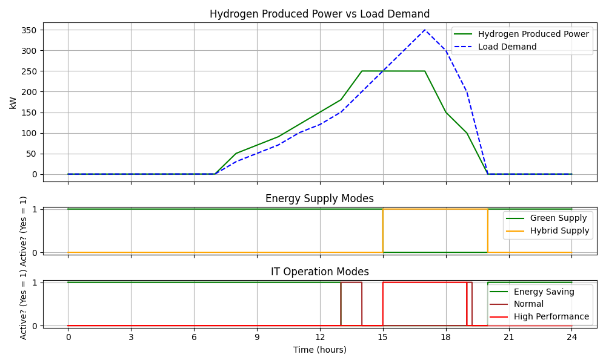

# IT System

This Modelica model simulates an IT system that generates hydrogen based on hourly input over a 24-hour period. It manages different operational modes and energy supply mechanisms to match the varying load demands of the system.

## 🎨 Contexts

- **Energy Supply Modes**:
  - **Hybrid Supply**: Supplies energy based on demand conditions.
  - **Green Supply**: Activated when hydrogen production is sufficient.
- **Performance Modes**:
  - **High-Performance Mode**: Activated for high demand (>200 units).
  - **Normal Mode**: Activated for moderate demand (150-200 units).
  - **Energy-Saving Mode**: Activated for low demand (<150 units).

## 🎡 Context Relationships

Two energy supply modes and three performance modes are mutually exclusive, meaning that activating one will automatically deactivate the others.

**highPerformanceMode** requires **hybridSupply**, meaning that **highPerformanceMode** can only be activated when **hybridSupply** is active. Additionally, deactivating **hybridSupply** will also deactivate **highPerformanceMode**.

The same principle applies to **energySavingMode**, which requires **greenSupply**.

## 🎉 Simulation Result

Let's focus on the **requirement** relationship.

The **highPerformanceMode** is designed to activate when **loadDemand** exceeds 200 (after 14 hours). However, due to its dependency on **hybridSupply**, it can only activate after 15 hours when **hybridSupply** is also active.

After 19.25 hours, the activation condition for **energySavingMode** becomes true. However, due to its dependency on **greenSupply**, it can only be activated after 20 hours, when **greenSupply** is activated.

